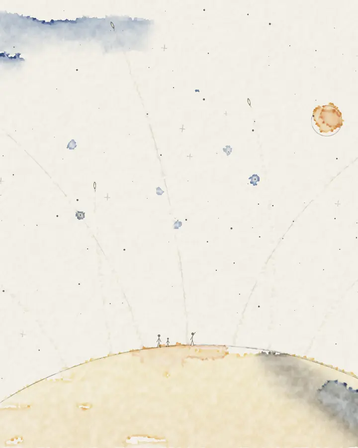

# Among the Stars

A watercolour sketch that paints itself on cold-press paper. A pencil line for a pale planet and a small moon, loose washes of ochre and indigo that spread and dry with dark edges, three tiny figures on the rim, and seven small ships drifting out along pencilled arcs into a sparse field of stars, leaving faint broken trails. Now and then a drop falls into the sky and blooms into a star. After 24 seconds the sheet fades back to clean paper and starts again. It takes its idea from the old VQGAN prompt "a minimalist watercolor sketch of humanity spreading across the stars", but no machine learning is involved: every mark comes from the code here.

[View it live](https://aalquwayfili.com/art/among-the-stars/) (needs WebGPU: Chrome, Edge, or Safari 26+).

How it works:

- **Water and pigment on a grid.** The sheet is a 720 × 400 grid of paper cells. Each holds water, three pigments still in the water (indigo, yellow ochre, burnt sienna) and the pigment already settled into the paper. One compute pass per 20 Hz step moves water between neighbours by their difference, and the pigment travels with it at the upstream concentration, so both are conserved. Dry paper only takes water from a full neighbour, and the threshold is raised on high points of the grain, which gives the washes ragged edges. It is a much simplified take on the layered model in [Curtis et al. 1997](https://doi.org/10.1145/258734.258896).
- **Dark edges and blooms.** Cells at the edge of a wash evaporate faster, so water keeps flowing outwards and carries pigment to the rim, where it dries darker. This is the coffee-ring effect described by [Deegan et al. 1997](https://doi.org/10.1038/39827). Clear water dropped into a drying wash pushes pigment out into a bloom. Pigment settles slowly while the paper is soaking and quickly as it dries, more in the hollows of the grain, which is where the granulation comes from.
- **The painter** is a list of 21 timed brush strokes: back-and-forth washes inside the planet's pencil line, clear water laid on the sky before indigo is touched in, a second glaze once the first is dry, and six drops for the stars. The brush path wanders, tapers at both ends and skips the tops of the grain at its edge. A small single-thread pass picks the strokes on the paper each step and places the ships, so the cell pass only looks at those.
- **Drawing.** One fullscreen pass lays the paper, lit from the upper left (value noise at a few scales), and composites the pigment over it with the Kubelka-Munk equations, as in Curtis et al. The absorption and scattering values are mine, not measured. The grid is read through a small warp and cut at a threshold set by the paper, so edges follow the grain instead of the cells. Pencil lines are distance fields that only mark the tops of the grain and draw themselves in; the figures, ships and star dots are pen strokes on top.

Options: `?quality=low` for a 360 × 200 grid (the default on software adapters). `?t=<seconds>` renders one deterministic frame at that time. The loop is 24 seconds long.
