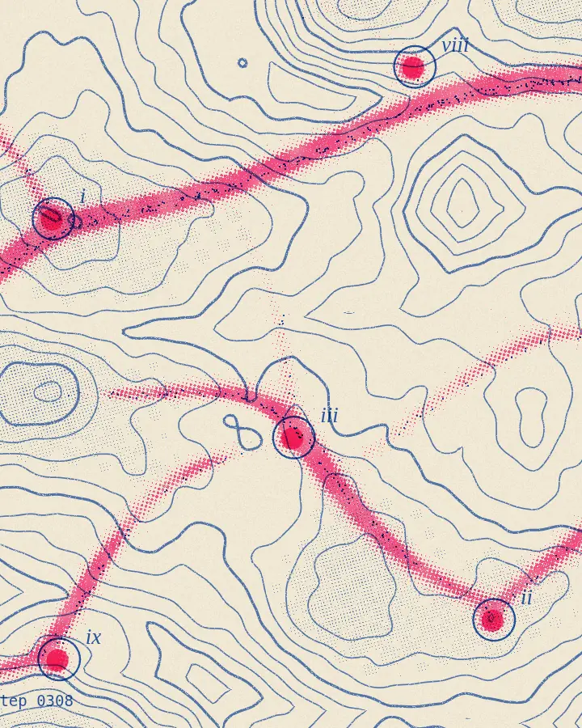

# Incense Road

20,000 slime-mould agents start at nine wells and find a caravan network through the valleys.

Physarum agents (Jones 2010) on a terrain, printed as a two-ink risograph over contour lines.

An `index.html` and the code in `main.js`; no libraries. [View it live](https://aalquwayfili.com/art/incense-road/). Add `?t=<seconds>` to render a single fixed frame.
