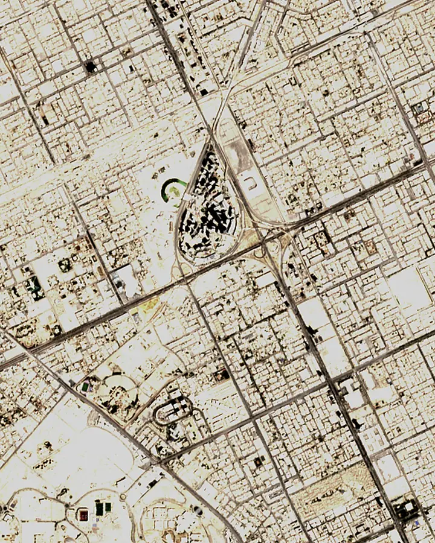

# KAFD, 1:1000

The King Abdullah Financial District in Riyadh as a model of toy bricks, built from map data at true 1:1000 scale: one stud is 8 m and one plate 3.2 m, which is what real bricks work out to. 36,965 bricks in 106 different parts, on an engineer's desk beside a pencil, a ruler and a cup of coffee at the same scale. It builds itself, runs from golden hour into night with traffic on the real roads, and rewinds.

[View it live](https://aalquwayfili.com/art/kafd/) (needs WebGPU: Chrome, Edge, or Safari 26+).

How it was made:

- **Footprints** come from [OpenStreetMap](https://www.openstreetmap.org/copyright) and [Overture Maps](https://overturemaps.org/), which adds [Microsoft's building footprints](https://github.com/microsoft/GlobalMLBuildingFootprints). Streets, the ring road and the motorways are OpenStreetMap's.
- **Heights.** Of the 351 buildings on the board, 22 have a height in the map and 15 a floor count (3.2 m a floor). The open maps are missing most of the towers in the core, so 25 of them are estimated: placed on open land inside the ring, turned to the nearest street, taller toward the centre. The other 289, mostly low-rise, get a plausible default. The four tallest mapped towers are real: 385 m, 304 m, 264 m and 231 m.
- **Colours.** Low-rise roofs take the nearest stone to their colour in a [Copernicus Sentinel-2](https://sentinels.copernicus.eu/) image of 21 September 2026. Towers are glass in silver, blue-grey, smoke, champagne and bronze, with podiums, setbacks near the top, mullions, crowns and, on the tallest, a mast.
- **Bricks.** Every building becomes cells one stud across and one plate tall; the cells merge into real brick sizes from the ground up, courses offset like a wall. A fragment shader traces each pixel through the 192 × 128 × 192 grid, as in [Brick by Brick](../brick-by-brick/).
- **Traffic** runs both ways on the real roads; palms line the main streets and lamps the motorways.

Map data © OpenStreetMap contributors (ODbL), Overture Maps Foundation. Contains modified Copernicus Sentinel data 2026.

Options: `?quality=low` traces at half resolution. `?t=<seconds>` renders one deterministic frame at that time.
