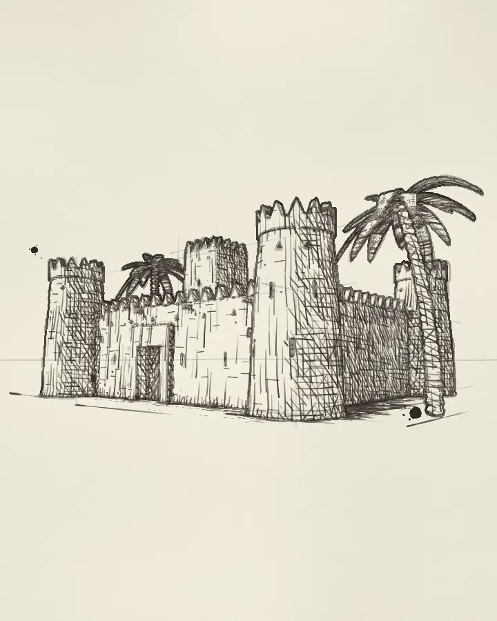

# Masmak

Al Masmak, the mud-brick fort in the middle of Riyadh, drawn on a sketchbook page as if from the square in front of it. Pencil guide lines go down first, then the ink outlines. Hatching builds up in the shadows, a sepia wash goes on, and the page turns.

[View it live](https://aalquwayfili.com/art/masmak/) (needs WebGPU: Chrome, Edge, or Safari 26+).

How it works:

- **The fort** is a signed distance field raymarched by sphere tracing ([Hart 1996](https://doi.org/10.1007/s003710050084)). It has four tapering corner towers, battered walls with pointed merlons, triangular vents and loopholes, a square watchtower inside, and a deep gate with a plank door and a small wicket. The model is loose, taken from what [photographs and descriptions](https://en.wikipedia.org/wiki/Al_Masmak_Palace) show: a clay and mud-brick fort with four watchtowers, built around 1865, where Ibn Saud's recapture of Riyadh took place in January 1902. None of its dimensions are measured. Two date palms stand beside it.
- **Once per window size**, a fullscreen pass writes a G-buffer: normal, distance, material and a pen tone taken from sun, soft shadow ([Quilez](https://iquilezles.org/articles/rmshadows/)) and ambient occlusion. The camera is kept level, so verticals stay vertical as in a two-point perspective sketch.
- **A plan pass**, also run once, works out every mark on the page. Each pixel stores how much ink it gets and the second in the loop when the pen reaches it. Hatching is procedural and follows the surface: walls use their own (along, up) coordinates, towers and trunks use (angle, height), and the ground uses its plan. There are four stroke families that switch on at rising tones. Every darker tone keeps the strokes of the lighter ones, which is the nesting of a tonal art map ([Praun et al. 2001](https://doi.org/10.1145/383259.383328)). Rows are spaced in screen pixels using the surface-to-screen Jacobian, and every other row is dropped where a surface turns away. Each stroke gets its own length, tilt, bow and fading pressure, and is drawn from its start.
- **Outlines** come from depth jumps, normal creases and material seams in the G-buffer ([Saito and Takahashi 1990](https://doi.org/10.1145/97880.97901)). They are traced twice through slow wobbles and appear from the top left onward. The same pass lays out the ruled pencil lines toward the vanishing points and short texture dashes on the lit mud.
- **Every frame** one cheap pass reveals the ink that is due, then adds the paper tooth, two ink blots and the page turn. It also adds the sepia washes, which are the fort's silhouette blurred and pushed off the lines with a darker rim where the pigment dries, in the spirit of [Curtis et al. 1997](https://doi.org/10.1145/258734.258896).

Options: `?quality=low` for shorter ray and shadow marches at 1× pixel density. `?t=<seconds>` renders one deterministic frame at that time. The loop is 26 seconds long.
