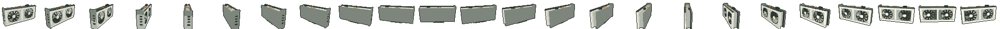

# Pixel GPU

| Original | Pixelated |
|---|---|
|  |  |

A 3D graphics card, turned into pixel art. It spins on [aalquwayfili.com](https://aalquwayfili.com), where you can drag it or turn it with the arrow keys.

[`gpu.js`](gpu.js) builds the card from boxes, rings and tubes in [three.js](https://threejs.org), renders it from 24 angles, and turns each frame into pixel art: 84×60, a 9-colour palette, and a 1px outline.

